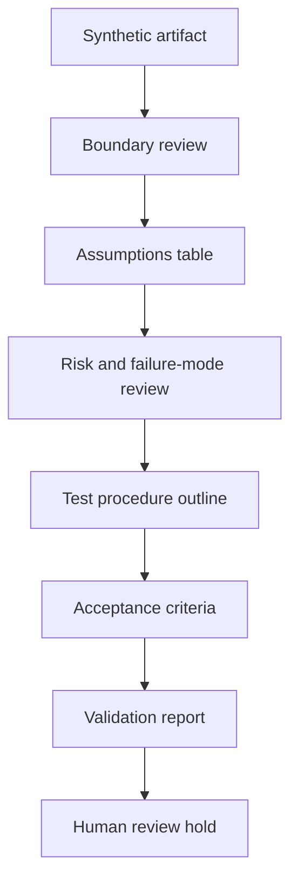

# Standards-Aware Validation Template

Status: scaffolded

## Problem Statement

Public engineering artifacts need a repeatable way to state assumptions, checks, risks, proof limits, and review status without implying certification, code compliance, stamped engineering, legal approval, safety approval, production readiness, or active service offerings.

## Synthetic Review Context

This template applies to synthetic public-safe artifacts such as diagrams, test procedure examples, validation reports, or engineering study notes. It does not describe a customer system or live procedure.

## Standards-Awareness Boundary

Standards awareness means a review knows where standards, safety, commissioning, and acceptance questions belong. It does not mean the artifact is approved, certified, stamped, or legally reviewed.

## Assumptions Table

| Assumption | Synthetic value | Review note |
| --- | --- | --- |
| System type | Generic review artifact | No production procedure |
| Inputs | Synthetic values only | No private measurements |
| Evidence | Template fields | No customer deliverable |

## Non-Certified Safety Checklist

| Check | Question | Status |
| --- | --- | --- |
| Boundary | Does the artifact state what is excluded? | planned |
| Risk | Are hazards tracked at a generic level? | planned |
| Validation | Is the method named without overclaiming? | planned |

## Commissioning And Test Procedure Outline

1. Define scope.
2. Confirm assumptions.
3. Run synthetic review steps.
4. Compare acceptance criteria.
5. Record proof limits.

## Risk Register Fields

`risk_id`, `category`, `synthetic_hazard`, `assumption`, `mitigation`, `residual_risk`, `review_status`.

## Failure-Mode Table Fields

`mode`, `cause_category`, `effect_category`, `detection_method`, `mitigation`, `review_status`.

## Acceptance Criteria Language

Acceptance criteria are review gates for synthetic artifacts. They are not certification, legal approval, safety approval, or production readiness evidence.

## Validation Report Structure

- Scope.
- Assumptions.
- Method.
- Observations.
- Limits.
- Open questions.
- Human review status.

## Mermaid Validation Review Diagram

## Validation Questions

- Does the artifact avoid certification claims?
- Does it avoid code-compliance claims?
- Does it avoid stamped-engineering implications?
- Does it exclude customer procedures and production procedures?
- Does it keep active client deliverables out?

## What This Proves

This proves a public-safe template structure for standards-aware validation review.

## What This Does Not Prove

This does not prove certification, code compliance, stamped engineering, legal approval, safety approval, production readiness, customer acceptance, or release status.

## Public / Private / Sealed Checklist

| Boundary | Status |
| --- | --- |
| Public-safe synthetic template only | scaffolded |
| Customer data absent | review |
| Foundation-private data absent | review |
| Secrets and credentials absent | review |
| Private logs absent | review |
| Sealed source absent | review |
