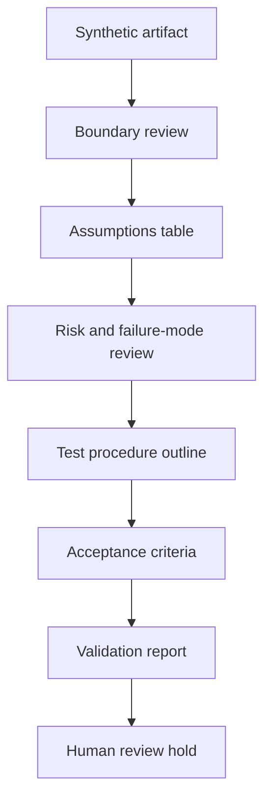

# Standards-Aware Validation Template

Status: scaffolded

## Problem Statement

Public engineering artifacts need a repeatable way to state assumptions, checks, risks, proof limits, and review status without implying certification, code compliance, stamped engineering, legal approval, safety approval, production readiness, or active service offerings.

## Synthetic Standards / Validation Context

This template applies to synthetic public-safe artifacts such as diagrams, test procedure examples, validation reports, or engineering study notes. It does not describe a customer system, live procedure, production procedure, active client deliverable, or private operating record.

The synthetic review context assumes a generic engineering artifact with invented inputs, invented acceptance fields, and review-only status. The artifact may be used to practice validation discipline, not to approve a real system.

## Standards-Aware Vs Certified Boundary

Standards-aware means a review knows where standards, safety, commissioning, test, risk, failure-mode, and acceptance questions belong. Certified means a separate authorized process has approved an artifact under a defined authority. This template is standards-aware only. It is not certified, not stamped, not legal approval, not code compliance approval, and not safety approval.

## Assumptions Table

| Assumption | Synthetic value | Review note |
| --- | --- | --- |
| System type | Generic review artifact | No production procedure |
| Inputs | Synthetic values only | No private measurements |
| Evidence | Template fields | No customer deliverable |

## Safety Checklist

| Check | Question | Status |
| --- | --- | --- |
| Boundary | Does the artifact state what is excluded? | planned |
| Risk | Are hazards tracked at a generic level? | planned |
| Validation | Is the method named without overclaiming? | planned |
| Evidence | Is evidence synthetic, public-safe, and reviewable? | planned |
| Approval language | Does the artifact avoid certified, stamped, legal, and safety approval language? | planned |

## Commissioning / Test Procedure Example

| Step | Synthetic action | Expected record | Boundary |
| --- | --- | --- | --- |
| 1 | Define synthetic scope | Scope note | No customer procedure |
| 2 | Confirm assumptions | Assumption table | No private measurement |
| 3 | Run review-only test step | Observation field | No live commissioning |
| 4 | Compare acceptance criteria | Pass/fail placeholder | No production readiness |
| 5 | Record proof limits | Validation report section | No approval claim |

## Risk / Failure-Mode Table

| ID | Category | Synthetic risk or mode | Detection / review method | Mitigation | Review status |
| --- | --- | --- | --- | --- | --- |
| R-001 | Boundary | Artifact language could be read as approval | Claim review | Add proof-limit text | planned |
| R-002 | Data | Private detail could enter an example | Boundary scan | Use invented inputs only | planned |
| F-001 | Procedure | Test step could resemble production procedure | Human review | Label as synthetic example | planned |
| F-002 | Evidence | Observation could be mistaken for validation result | Status review | Keep scaffolded posture | planned |

## Acceptance Criteria

| Criterion | Evidence expected | Passing posture | Limit |
| --- | --- | --- | --- |
| Scope complete | Problem statement and synthetic context exist | Review-ready | Not customer work |
| Boundary complete | Public/private/sealed checklist exists | Review-ready | Not publication approval |
| Risk reviewed | Risk/failure-mode table exists | Review-ready | Not safety approval |
| Validation named | Validation questions and method exist | Review-ready | Not certification |
| Status bounded | Status remains `scaffolded` | Review-ready | Not released |

## Validation Report Structure

- Scope.
- Assumptions.
- Method.
- Observations.
- Limits.
- Open questions.
- Human review status.

## Mermaid Validation Review Diagram

## Validation Questions

- Does the artifact avoid certification claims?
- Does it avoid code-compliance claims?
- Does it avoid stamped-engineering implications?
- Does it distinguish standards-aware review from certified approval?
- Does it provide a synthetic commissioning/test procedure example?
- Does it include risk, failure-mode, and acceptance criteria fields?
- Does it exclude customer procedures and production procedures?
- Does it keep active client deliverables out?

## What This Proves

This proves a public-safe template structure for standards-aware validation review, including assumptions, safety checklist prompts, synthetic commissioning/test procedure structure, risk/failure-mode review, acceptance criteria, proof limits, and human review gates.

## What This Does Not Prove

This does not prove certification, code compliance, stamped engineering, legal approval, safety approval, production readiness, customer acceptance, production procedure validity, physical validation, publication approval, or release status.

## Public / Private / Sealed Checklist

| Boundary | Status |
| --- | --- |
| Public-safe synthetic template only | scaffolded |
| Customer data absent | review |
| Foundation-private data absent | review |
| Secrets and credentials absent | review |
| Private URLs absent | review |
| Production procedures absent | review |
| Private logs absent | review |
| Sealed source absent | review |
| Active client deliverables absent | review |
